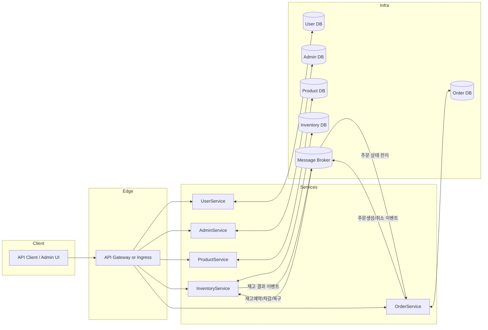

# ShoppingMallByMSA
# ECommercialMSA

> 도메인 중심 설계(DDD)와 마이크로서비스 아키텍처(MSA) 기반으로 구현한 **이커머스 백엔드** 모노레포입니다. 채용 평가자가 **가치와 깊이**를 빠르게 파악할 수 있도록 구성했습니다.

<p align="left">
  <a href="#-tech-stack"></a>
  <a href="#-tech-stack"></a>
  <a href="#-tech-stack"></a>
  <a href="#-observability"></a>
</p>

---

## 🧭 Table of Contents

* [모듈 구성](#-모듈-구성)
* [전체 아키텍처](#-전체-아키텍처)
* [현재 구현 상태](#-현재-구현-상태-요약)
* [핵심 설계 포인트](#-핵심-설계-포인트)
* [테스트 전략](#-테스트-전략)
* [로컬 실행](#-로컬-실행)
* [API 개요](#-api-개요-샘플)
* [로드맵](#-로드맵)
* [프로젝트 운영 가이드](#-프로젝트-운영-가이드)
* [소개](#-소개)

---

## 📦 모듈 구성

* **[AdminService](./AdminService/)**: 조직/회사 관리, 관리자 권한(Role) 관리
* **[UserService](./UserService/)**: 사용자 계정/권한, AOP 기반 접근 로그
* **[ProductService](./ProductService/)**: 상품/카테고리 관리
* **[InventoryService](./InventoryService/)**: 재고 관리(예약/차감/복구 설계)
* **[OrderService](./OrderService/)**: 주문 생성/조회, 주문 상태 관리
* **[event-common](./event-common/)**: 서비스 간 공용 DTO/이벤트/유틸 모듈

> 각 모듈은 독립 실행 가능하며, 공통 의존성은 `event-common`에 정의합니다.

---

## 🗺️ 전체 아키텍처



* 서비스 간 강한 결합을 피하기 위해 **이벤트 기반 비동기 통신**을 전제로 설계합니다.
* 동시성/일관성 과제를 해결하기 위해 **상태 전이(State Machine)**, **멱등 처리**, \*\*Outbox 패턴(예정)\*\*을 채택합니다.

---

## ✅ 현재 구현 상태 (요약)

| 도메인       | 구현 항목                             | 비고                  |
| --------- | --------------------------------- | ------------------- |
| Admin     | 회사 등록 API, Admin 기본 API, 관리자 Role | 기본 관리 기능 완료         |
| Product   | 카테고리 기능 구현                        | 상품/카테고리 도메인 시작      |
| Order     | 주문 목록 조회 API                      | 조회 기능부터 단계적 확장      |
| User      | AOP 기반 로깅 추가                      | 접근/행위 로깅 기반 마련      |
| Inventory | 재고 모델/흐름 설계                       | 예약/차감/복구 구현 진행 예정   |
| Payment   | (모듈 정리)                           | 결제/환불은 **로드맵**으로 이동 |

> 세부 구현은 각 서비스의 `controller`, `service`, `repository` 패키지에서 확인하세요.

---

## 🔑 핵심 설계 포인트

### 1) 상태 전이 기반 주문/재고 처리

* `ORDER_CREATED` → 재고 예약 요청 → 예약 성공 시 `ORDER_CONFIRMED` / 실패 시 `ORDER_CANCELLED`
* 재고 반영 실패/타임아웃 시 **보상(Compensation) 흐름**으로 롤백

### 2) 멱등성 & 재시도 전략

* **Idempotency-Key**(요청 헤더) 저장 후 중복 실행 차단 (중요 API 우선 적용)
* 외부 연동/메시지 처리에 **지수 백오프 재시도** 전략 도입

### 3) Outbox & 비동기 이벤트

* 트랜잭션 내 **Outbox 테이블**에 이벤트 영속화 → 별도 컨슈머가 브로커 전송
* 전송 실패 시 재시도/데드레터 큐로 안정성 확보

### 4) AOP 기반 공통 관심사 처리

* 접근 로깅, 실행 시간 측정, 트랜잭션 경계 로깅 등을 **Aspect**로 모듈화

---


---

## 🚀 로컬 실행

### 사전 준비

* JDK 17+
* (선택) 로컬 RDBMS & 메시지 브로커

### 서비스 개별 실행 예시

```bash
# 각 서비스 디렉터리에서
cd UserService && ./gradlew bootRun
cd ProductService && ./gradlew bootRun
cd InventoryService && ./gradlew bootRun
cd OrderService && ./gradlew bootRun
cd AdminService && ./gradlew bootRun
```

> 실제 포트/프로파일/DB 설정은 각 서비스의 `application.yml`에서 수정하세요.

---

## 📚 API 개요 (샘플)

> 정확한 엔드포인트는 각 서비스의 Controller를 참고하세요. 아래는 대표 플로우 예시입니다.

### OrderService

* `GET /api/orders` : 주문 목록 조회 (구현)
* `POST /api/orders` : 주문 생성 (확장 예정)

### ProductService

* `GET /api/categories` : 카테고리 조회 (구현)
* `POST /api/categories` : 카테고리 생성 (구현)

### AdminService

* `POST /api/companies` : 회사 등록 (구현)
* `GET /api/admin/roles` : 관리자 권한 조회 (구현)

### UserService

* `POST /api/users` : 회원 가입 (예정)
* `POST /api/auth/login` : 로그인 (예정)

### InventoryService

* `POST /api/inventories/reserve` : 재고 예약 (예정)
* `POST /api/inventories/release` : 재고 복구 (예정)

---

## 🔭 로드맵

* **결제/환불 도메인 재도입**

  * 전액/부분 환불, 승인취소/환불 구분
  * `Idempotency-Key`, 상태 머신, 보상 트랜잭션(Saga)
  * Outbox + 재시도 + 감사 로그(Audit)
* **문서화 고도화**

  * OpenAPI(Swagger) 문서, API 예제 응답, 상태 전이 다이어그램
* **관측성**

  * 구조화 로그, 요청 추적(TraceId), 메트릭/헬스체크
* **배포 자동화**

  * Docker/Compose, CI 파이프라인, 프로파일 분리(dev/stage/prod)

---

## 🧭 프로젝트 운영 가이드

* **커밋 컨벤션**: `feat:`, `fix:`, `docs:`, `refactor:`, `test:`
* **패키지 규칙**: `controller` / `service` / `domain(model)` / `repository` / `config`
* **예외 처리**: 도메인 예외 → 공통 핸들러 → 표준 에러 응답(JSON)
* **보안/권한**: 최소 권한(Least Privilege), 관리자/일반 사용자 역할 분리

---

## 🙋‍♂️ 소개

* 작성자: **jaeil jeong**
* 관심사: 결제/주문/재고의 **분산 일관성**, 보상 트랜잭션, 멱등/재시도, 이벤트 드리븐 아키텍처

> 피드백/리뷰 환영합니다. 이슈에 남겨주세요!
